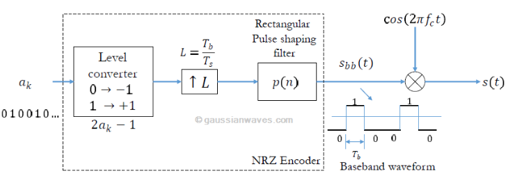

# TxRx BPSK Modulation
This project involves implementing a digital communication system for transmitting a text file using BPSK/QPSK modulation. Two LimeSDR boards will be used: one for transmission and the other one for reception.

# Content
1. Objectives
2. [Definitions](#definitions)
3. [Procedure](#procedure)
	- [Transmissor](#transmissor)
	- [Receptor](#receptor)
4. [Results](#results)
5. [Findings](#findings)
6. [Conclusions](#conclusions)
7. [References](#references)
8. [Credits](#credits)

# Objectives
1. Uploading of different types of files for subsequent processing.
2. Modulation of a text file using BPSK in block diagramming software (such as GNU Radio).
3. Integrate the hardware, being the LimeSDR device to develop a correct transmission and reception. Both with their respective modulation and demodulation.

# Definitions
- BPSK Modulation

  

  *[Figura 1](Mathuranathan, 2020)*

- GNU Radio
- LimeSDR
- Interpolation
- Decimation

# Procedure
Both transmitter and receiver were created with block designs on GNU Radio, based on the following links:
https://nuclearrambo.com/wordpress/transferring-a-text-file-over-the-air-with-limesdr-mini/
https://wiki.gnuradio.org/index.php?title=File_transfer_using_Packet_and_BPSK
https://www.youtube.com/watch?v=UpiaL1Hr6-s

Having said that, the Tx diagram
On the other hand, the Rx diagram

# Results

# Findings
- It was incurred in a gain problem. The error statement referred to low gain usage, where "device_handler::set_gain()" was 6dB. However, the Tx needed 40 dB.

# Conclusions
1. 

# References
- NUCLEARRAMBO. (2019). *Transferring a text file over the air with LimeSDR mini*. https://nuclearrambo.com/wordpress/transferring-a-text-file-over-the-air-with-limesdr-mini/
- Duggan, B. (2023). *File transfer using Packet and BPSK*. https://wiki.gnuradio.org/index.php?title=File_transfer_using_Packet_and_BPSK

# Credits
Javier Castañeda, Hellnska Velásquez, Pablo Flores, Rafael Toj, Sandra López, Rafael Gómez, Juan Barillas, Rodrigo Méndez & Camila Puaque.