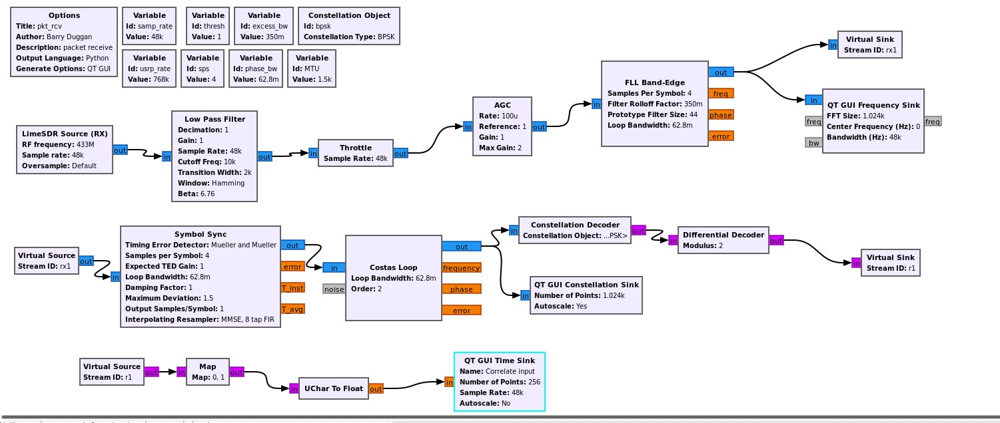
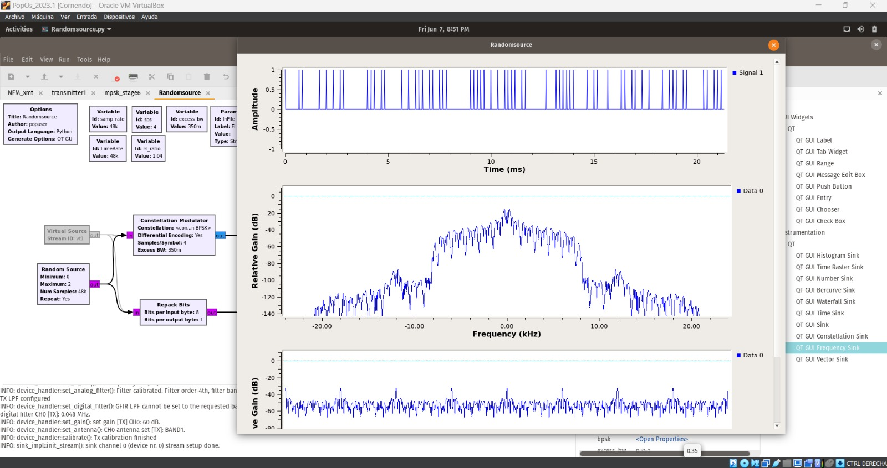
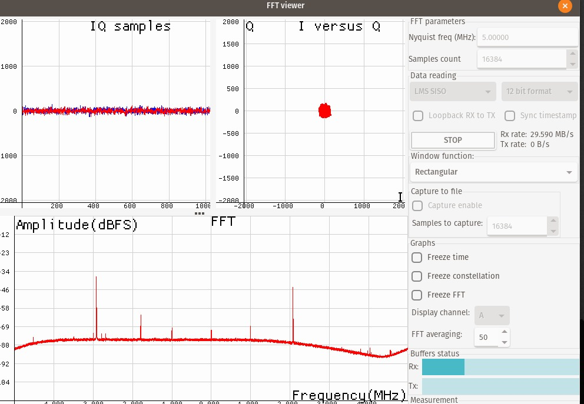
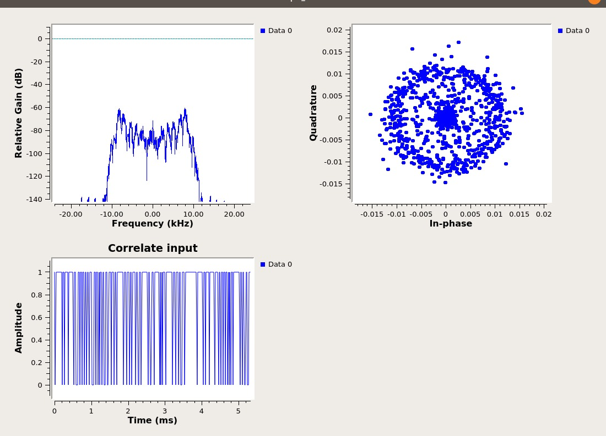

<<<<<<< HEAD
# TxRx BPSK Modulation
This project involves implementing a digital communication system for transmitting a text file using BPSK/QPSK modulation. Two LimeSDR boards will be used: one for transmission and the other one for reception.

# Content
1. Objectives
2. [Definitions](#definitions)
3. [Procedure](#procedure)
	- [Transmitter](#transmissor)
	- [Receptor](#receptor)
4. [Results](#results)
5. [Findings](#findings)
6. [Conclusions](#conclusions)
7. [References](#references)
8. [Credits](#credits)

# Objectives
1. Uploading of different types of files for subsequent processing.
2. Modulation of a text file using BPSK in block diagramming software (such as GNU Radio).
3. Integrate the hardware, being the LimeSDR device to develop a correct transmission and reception. Both with their respective modulation and demodulation.

# Definitions
- BPSK Modulation
  
BPSK stands for "Binary Phase Shift Keying". It is a type of modulation used in digital communication systems to transmit binary data over a communication channel.

In this type of modulation, the carrier signal is modulated by changing its phase by 180 degrees for each binary symbol. Specifically, a binary 0 is represented by a phase shift of 180 degrees, while a binary 1 is represented by no phase shift.

Having said the previous statement, a BPSK transmitter is implemented by coding the message bits using NRZ coding (1 represented by positive voltage and 0 represented by negative voltage) and multiplying the output by a reference oscillator running at carrier frequency f_c.

  

  *[BPSK transmitter](https://www.gaussianwaves.com/2010/04/bpsk-modulation-and-demodulation-2/)*

  

  *[BPSK Receiver](https://www.gaussianwaves.com/2010/04/bpsk-modulation-and-demodulation-2/)*

- GNU Radio

GNU Radio is a free and open-source software development toolkit that provides signal processing blocks to implement software radios. It can be used with readily available, low-cost external RF hardware to create software-defined radios (SDRs), or without hardware in a simulation-like environment. GNU Radio is widely used in research, education, and hobbyist applications, providing a flexible platform for working with radio frequency (RF) signals and developing various communication systems.
LimeSDR is a software-defined radio (SDR) platform that is versatile, low-cost, and open-source, designed for a broad range of wireless communication applications. It is based on field-programmable gate array (FPGA) technology and features a highly flexible, full-duplex transceiver capable of supporting frequencies from 100 kHz to 3.8 GHz. This wide frequency range allows LimeSDR to handle a variety of communication standards, including LTE, GSM, UMTS, Wi-Fi, Bluetooth, and more.

- LimeSDR

LimeSDR is a series of open-source hardware platform designed for radio communication.  These software-defined radios (SDRs) are essentially programmable radios that can be configured to receive and transmit a wide range of signals, offering greater flexibility than traditional radios. LimeSDR is compatible with various software applications, enabling tasks like signal analysis, spectrum monitoring, and even prototyping wireless communication systems.

- Interpolation

Interpolation refers to the manipulation of the signal's sampling rate. The SDR receives a signal at a specific rate and it increases the sampling rate. It essentially creates new samples between the existing ones to achieve a smoother, higher-resolution signal. This is important for tasks like upconverting the signal to a higher frequency for transmission or accurately representing higher bandwidth signals. 

- Decimation

Decimation refers to a technique used to reduce the number of samples collected from the analog signal. It works by throwing away a certain number of samples according to a chosen decimation rate. For instance, a rate of 2 discards every other sample, while a rate of 8 keeps only 1 out of every 8. This lowers the data rate delivered to the software, which can be helpful for reducing processing load on a computer.  

However, decimation also reduces the effective bandwidth that the SDR can capture. This means there will be any missing signals outside the remaining bandwidth. Additionally, while it can improve the signal-to-noise ratio (SNR) by effectively lowering the noise floor, it's important to remember this is because it works at a smaller slice of the spectrum. There's no actual increase in the signal strength itself.  The way decimation and the chosen rate are used depend on the specific signal of interest and the capabilities of the SDR hardware/software that is going to be used.

# Transmitter 
1. **EPB: File Source to Tagged Stream**
   - It is a Embedded Python Block that takes the place of a File_Source block, a Stream_to_Tagged_Stream block and parts of a Burst_Shaper block.

It performs the following functions:
   - Send a preamble to allow the receiver to synchronize.
   - Read the file in "Pkt_Len" chunks.
   - Convert the data to Base64, which produces 4 bytes of output for every 3 bytes of input.
   - Send each Base64 chunk with revised "packet_len" tags.
   - Send a post-file filler to assure that any buffers have been flushed.

# Receiver
On the other hand, the Rx diagram represents a receiver for BPSK modulation implemented in GNU Radio. The components are as follow:
1. **ZMQ SUB Source**:
   - This block receives data from a ZeroMQ socket.
   - Parameters such as the address, timeout, pass tags, and filter key are configured here.
   - The source rate is set to 768 kHz.

2. **Rational Resampler**:
   - This block resamples the input signal.
   - Interpolation is set to 1, and decimation is set to 16, effectively reducing the sample rate by a factor of 16.
   - Fractional BW is set to 0.

3. **Throttle**:
   - Controls the flow of samples through the system by limiting the sample rate to 48 kHz.

4. **AGC (Automatic Gain Control)**:
   - Adjusts the gain of the incoming signal to a desired level.
   - Gain is set to 1 with a maximum gain of 1.

5. **FLL Band-Edge**:
   - Frequency-locked loop (FLL) for coarse frequency correction.
   - Samples per symbol is set to 4, with a filter rolloff factor of 350m, and prototype filter size of 44.
   - Loop bandwidth is set to 62.8m.

6. **Constellation Decoder**:
   - Decodes the incoming BPSK signal using the specified constellation object (BPSK).
   - The constellation is a BPSK object with one point.

7. **Differential Decoder**:
   - Differentiates the phase of the received signal to recover the original data.
   - Modulus is set to 2.

8. **Virtual Sink**:
   - A placeholder block to monitor the output stream at this stage.
   - Stream ID is set to r1.

9. **Virtual Source**:
   - Takes the output from the previous Virtual Sink as input.
   - Stream ID is r1.

10. **Map**:
   - Maps input values to output values according to a defined mapping.
   - Map.0 is used here.

11. **Correlate Access Code - Tag Stream**:
   - Detects the presence of a specific access code in the incoming bitstream and tags it.
   - Access code is set to 111000100011.
   - Threshold is set to 1, and the tag name is packet_len.

12. **Repack Bits**:
   - Packs bits into bytes.
   - Bits per input byte is 1, and bits per output byte is 8.

13. **UChar to Float**:
   - Converts unsigned char data to floating-point format.

14. **QT GUI Time Sink**:
   - Visualizes the time domain signal.
   - The number of points is set to 256, with a sample rate of 48 kHz.

15. **Stream CRC32**:
   - Checks and verifies the CRC32 of the received packet.
   - Mode is set to Check CRC, with the length tag name as packet_len and packed set to Yes.

16. **File Sink**:
   - Writes the output data to a file.
   - File path is /output.tmp, unbuffered mode is on, and append file is set to Overwrite.

The way this block diagram works, as a general overview, is the following:
1. The **ZMQ SUB Source** receives the incoming data, which is then resampled and its rate controlled.
2. The signal goes through an **AGC** to normalize its amplitude.
3. **Frequency correction** is performed using the FLL Band-Edge block.
4. The **Constellation Decoder** and **Differential Decoder** work together to recover the original BPSK signal.
5. The signal is further processed by correlating access codes and repacking bits.
6. Finally, the processed signal is verified with CRC32 and saved to a file.

# Procedure
Both transmitter and receiver were created with block designs on GNU Radio, based on the following links:
https://nuclearrambo.com/wordpress/transferring-a-text-file-over-the-air-with-limesdr-mini/
https://wiki.gnuradio.org/index.php?title=File_transfer_using_Packet_and_BPSK
https://www.youtube.com/watch?v=UpiaL1Hr6-s

*Tx diagram*

  

  [Transmitter diagram](Tx file on GNU: Randomsource.py)

  

  [Previous transmitter diagram]

*Rx diagram*

  

  [Receiver diagram](Rx file on GNU: pkt_rcv.py)

# Results

[BPSK transmitter]

[BPSK receiver]

[BPSK receiver]

# Findings
- It was incurred in a gain problem. The error statement referred to low gain usage, where "device_handler::set_gain()" was 6dB. However, the Tx needed 40 dB.

- The transmission cam be checked via BPSK modulation with a LimeSDR card by opening the LimeGUI software with a receiving card and positioning yourself at the transmission frequency.

- When defining numbers with prefixes, for example MHz or KHz, it is necessary to enter the corresponding number of "0s" and not the prefix as this could incur a syntax error.

- The access key must be the same for both the transmitter and the receiver, as they use this to encode and decode the message.

# Conclusions
1. The integration of LimeSDR hardware with GNU Radio software demonstrates effective modulation and demodulation processes, highlighting the project's technical proficiency.

2. The project faced issues with transmission gain, initially set to 6dB but required an adjustment to 40dB, showing the need for precise calibration in signal processing.

3. Uploading different types of files ensures flexibility in handling various data forms. With this you'll have efficient data manipulation and analysis. You can also use different programming blocks as a source for the subsequent processing.

# References
- NUCLEARRAMBO. (2019). *Transferring a text file over the air with LimeSDR mini*. https://nuclearrambo.com/wordpress/transferring-a-text-file-over-the-air-with-limesdr-mini/
- Duggan, B. (2023). *File transfer using Packet and BPSK*. https://wiki.gnuradio.org/index.php?title=File_transfer_using_Packet_and_BPSK

# Credits
=======
# TxRx BPSK Modulation
This project involves implementing a digital communication system for transmitting a text file using BPSK/QPSK modulation. Two LimeSDR boards will be used: one for transmission and the other one for reception.

# Content
1. Objectives
2. [Definitions](#definitions)
3. [Procedure](#procedure)
	- [Transmitter](#transmissor)
	- [Receptor](#receptor)
4. [Results](#results)
5. [Findings](#findings)
6. [Conclusions](#conclusions)
7. [References](#references)
8. [Credits](#credits)

# Objectives
1. Uploading of different types of files for subsequent processing.
2. Modulation of a text file using BPSK in block diagramming software (such as GNU Radio).
3. Integrate the hardware, being the LimeSDR device to develop a correct transmission and reception. Both with their respective modulation and demodulation.

# Definitions
- BPSK Modulation
  
BPSK stands for "Binary Phase Shift Keying". It is a type of modulation used in digital communication systems to transmit binary data over a communication channel.

In this type of modulation, the carrier signal is modulated by changing its phase by 180 degrees for each binary symbol. Specifically, a binary 0 is represented by a phase shift of 180 degrees, while a binary 1 is represented by no phase shift.

Having said the previous statement, a BPSK transmitter is implemented by coding the message bits using NRZ coding (1 represented by positive voltage and 0 represented by negative voltage) and multiplying the output by a reference oscillator running at carrier frequency f_c.

  

  *[BPSK transmitter](https://www.gaussianwaves.com/2010/04/bpsk-modulation-and-demodulation-2/)*

  

  *[BPSK Receiver](https://www.gaussianwaves.com/2010/04/bpsk-modulation-and-demodulation-2/)*

- GNU Radio

GNU Radio is a free and open-source software development toolkit that provides signal processing blocks to implement software radios. It can be used with readily available, low-cost external RF hardware to create software-defined radios (SDRs), or without hardware in a simulation-like environment. GNU Radio is widely used in research, education, and hobbyist applications, providing a flexible platform for working with radio frequency (RF) signals and developing various communication systems.
LimeSDR is a software-defined radio (SDR) platform that is versatile, low-cost, and open-source, designed for a broad range of wireless communication applications. It is based on field-programmable gate array (FPGA) technology and features a highly flexible, full-duplex transceiver capable of supporting frequencies from 100 kHz to 3.8 GHz. This wide frequency range allows LimeSDR to handle a variety of communication standards, including LTE, GSM, UMTS, Wi-Fi, Bluetooth, and more.

- LimeSDR

LimeSDR is a series of open-source hardware platform designed for radio communication.  These software-defined radios (SDRs) are essentially programmable radios that can be configured to receive and transmit a wide range of signals, offering greater flexibility than traditional radios. LimeSDR is compatible with various software applications, enabling tasks like signal analysis, spectrum monitoring, and even prototyping wireless communication systems.

- Interpolation

Interpolation refers to the manipulation of the signal's sampling rate. The SDR receives a signal at a specific rate and it increases the sampling rate. It essentially creates new samples between the existing ones to achieve a smoother, higher-resolution signal. This is important for tasks like upconverting the signal to a higher frequency for transmission or accurately representing higher bandwidth signals. 

- Decimation

Decimation refers to a technique used to reduce the number of samples collected from the analog signal. It works by throwing away a certain number of samples according to a chosen decimation rate. For instance, a rate of 2 discards every other sample, while a rate of 8 keeps only 1 out of every 8. This lowers the data rate delivered to the software, which can be helpful for reducing processing load on a computer.  

However, decimation also reduces the effective bandwidth that the SDR can capture. This means there will be any missing signals outside the remaining bandwidth. Additionally, while it can improve the signal-to-noise ratio (SNR) by effectively lowering the noise floor, it's important to remember this is because it works at a smaller slice of the spectrum. There's no actual increase in the signal strength itself.  The way decimation and the chosen rate are used depend on the specific signal of interest and the capabilities of the SDR hardware/software that is going to be used.

# Procedure
Both transmitter and receiver were created with block designs on GNU Radio, based on the following links:
https://nuclearrambo.com/wordpress/transferring-a-text-file-over-the-air-with-limesdr-mini/
https://wiki.gnuradio.org/index.php?title=File_transfer_using_Packet_and_BPSK
https://www.youtube.com/watch?v=UpiaL1Hr6-s

*Tx diagram*

  

  [Transmitter diagram]

  

  [Previous transmitter diagram]

*Rx diagram*

  

  [Receiver diagram]

# Results

[BPSK transmitter]

[BPSK receiver]

[BPSK receiver]

# Findings
- It was incurred in a gain problem. The error statement referred to low gain usage, where "device_handler::set_gain()" was 6dB. However, the Tx needed 40 dB.

- The transmission cam be checked via BPSK modulation with a LimeSDR card by opening the LimeGUI software with a receiving card and positioning yourself at the transmission frequency.

- When defining numbers with prefixes, for example MHz or KHz, it is necessary to enter the corresponding number of "0s" and not the prefix as this could incur a syntax error.

- The access key must be the same for both the transmitter and the receiver, as they use this to encode and decode the message.

# Conclusions
1. The integration of LimeSDR hardware with GNU Radio software demonstrates effective modulation and demodulation processes, highlighting the project's technical proficiency.

2. The project faced issues with transmission gain, initially set to 6dB but required an adjustment to 40dB, showing the need for precise calibration in signal processing.

3. Uploading different types of files ensures flexibility in handling various data forms. With this you'll have efficient data manipulation and analysis. You can also use different programming blocks as a source for the subsequent processing.

# References
- NUCLEARRAMBO. (2019). *Transferring a text file over the air with LimeSDR mini*. https://nuclearrambo.com/wordpress/transferring-a-text-file-over-the-air-with-limesdr-mini/
- Duggan, B. (2023). *File transfer using Packet and BPSK*. https://wiki.gnuradio.org/index.php?title=File_transfer_using_Packet_and_BPSK

# Credits
>>>>>>> dbbf488bd8cf9f9c0769ae78549485a1f4f52571
Javier Castañeda, Hellnska Velásquez, Pablo Flores, Rafael Toj, Sandra López, Rafael Gómez, Juan Barillas, Rodrigo Méndez & Camila Puaque.
