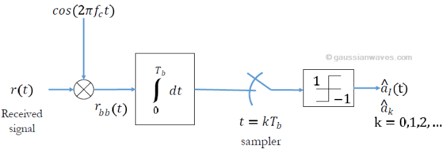

# TxRx BPSK Modulation
This project involves implementing a digital communication system for transmitting a text file using BPSK/QPSK modulation. Two LimeSDR boards will be used: one for transmission and the other one for reception.

# Content
1. [Keywords](#keywords)
2. [Objectives](#objectives)
3. [Definitions](#definitions)
4. [Procedure](#procedure)
	- [Transmitter](#transmitter)
	- [Receiver](#receiver)
5. [Results](#results)
6. [Findings](#findings)
7. [Conclusions](#conclusions)
8. [References](#references)
9. [Credits](#credits)

# Keywords
BPSK modulation, transmitter, receiver, LimeSDR, GNU Radio, Interpolation, Decimation, Software Defined Radio

# Objectives
1. Uploading of different types of files for subsequent processing.
2. Modulation of a text file using BPSK in block diagramming software (such as GNU Radio).
3. Integrate the hardware, being the LimeSDR device to develop a correct transmission and reception. Both with their respective modulation and demodulation.

# Definitions
- BPSK Modulation

  

  *[BPSK transmitter](https://www.gaussianwaves.com/2010/04/bpsk-modulation-and-demodulation-2/)*

  

  *[BPSK Receiver](https://www.gaussianwaves.com/2010/04/bpsk-modulation-and-demodulation-2/)*

- GNU Radio
  

- LimeSDR
- Interpolation
- Decimation

In Software Defined Radio (SDR), decimation refers to a technique used to reduce the number of samples collected from the analog signal. It works by throwing away a certain number of samples according to a chosen decimation rate. For instance, a rate of 2 discards every other sample, while a rate of 8 keeps only 1 out of every 8. This lowers the data rate delivered to the software, which can be helpful for reducing processing load on a computer.  

However, decimation also reduces the effective bandwidth that the SDR can capture. This means there will be any missing signals outside the remaining bandwidth. Additionally, while it can improve the signal-to-noise ratio (SNR) by effectively lowering the noise floor, it's important to remember this is because it works at a smaller slice of the spectrum. There's no actual increase in the signal strength itself.  The way decimation and the chosen rate are used depend on the specific signal of interest and the capabilities of the SDR hardware/software that is going to be used.

# Procedure
Both transmitter and receiver were created with block designs on GNU Radio, based on the following links:
https://nuclearrambo.com/wordpress/transferring-a-text-file-over-the-air-with-limesdr-mini/
https://wiki.gnuradio.org/index.php?title=File_transfer_using_Packet_and_BPSK
https://www.youtube.com/watch?v=UpiaL1Hr6-s

# Transmitter 
1. **EPB: File Source to Tagged Stream**
   - It is a Embedded Python Block that takes the place of a File_Source block, a Stream_to_Tagged_Stream block and parts of a Burst_Shaper block.

It performs the following functions:
   - Send a preamble to allow the receiver to synchronize.
   - Read the file in "Pkt_Len" chunks.
   - Convert the data to Base64, which produces 4 bytes of output for every 3 bytes of input.
   - Send each Base64 chunk with revised "packet_len" tags.
   - Send a post-file filler to assure that any buffers have been flushed.

# Receiver
On the other hand, the Rx diagram represents a receiver for BPSK modulation implemented in GNU Radio. The components are as follow:
1. **ZMQ SUB Source**:
   - This block receives data from a ZeroMQ socket.
   - Parameters such as the address, timeout, pass tags, and filter key are configured here.
   - The source rate is set to 768 kHz.

2. **Rational Resampler**:
   - This block resamples the input signal.
   - Interpolation is set to 1, and decimation is set to 16, effectively reducing the sample rate by a factor of 16.
   - Fractional BW is set to 0.

3. **Throttle**:
   - Controls the flow of samples through the system by limiting the sample rate to 48 kHz.

4. **AGC (Automatic Gain Control)**:
   - Adjusts the gain of the incoming signal to a desired level.
   - Gain is set to 1 with a maximum gain of 1.

5. **FLL Band-Edge**:
   - Frequency-locked loop (FLL) for coarse frequency correction.
   - Samples per symbol is set to 4, with a filter rolloff factor of 350m, and prototype filter size of 44.
   - Loop bandwidth is set to 62.8m.

6. **Constellation Decoder**:
   - Decodes the incoming BPSK signal using the specified constellation object (BPSK).
   - The constellation is a BPSK object with one point.

7. **Differential Decoder**:
   - Differentiates the phase of the received signal to recover the original data.
   - Modulus is set to 2.

8. **Virtual Sink**:
   - A placeholder block to monitor the output stream at this stage.
   - Stream ID is set to r1.
     
9. **Virtual Source**:
   - Takes the output from the previous Virtual Sink as input.
   - Stream ID is r1.

10. **Map**:
   - Maps input values to output values according to a defined mapping.
   - Map.0 is used here.

11. **Correlate Access Code - Tag Stream**:
   - Detects the presence of a specific access code in the incoming bitstream and tags it.
   - Access code is set to 111000100011.
   - Threshold is set to 1, and the tag name is packet_len.

12. **Repack Bits**:
   - Packs bits into bytes.
   - Bits per input byte is 1, and bits per output byte is 8.

13. **UChar to Float**:
   - Converts unsigned char data to floating-point format.

14. **QT GUI Time Sink**:
   - Visualizes the time domain signal.
   - The number of points is set to 256, with a sample rate of 48 kHz.

15. **Stream CRC32**:
   - Checks and verifies the CRC32 of the received packet.
   - Mode is set to Check CRC, with the length tag name as packet_len and packed set to Yes.

16. **File Sink**:
   - Writes the output data to a file.
   - File path is /output.tmp, unbuffered mode is on, and append file is set to Overwrite.

The way this block diagram works, as a general overview, is the following:
1. The **ZMQ SUB Source** receives the incoming data, which is then resampled and its rate controlled.
2. The signal goes through an **AGC** to normalize its amplitude.
3. **Frequency correction** is performed using the FLL Band-Edge block.
4. The **Constellation Decoder** and **Differential Decoder** work together to recover the original BPSK signal.
5. The signal is further processed by correlating access codes and repacking bits.
6. Finally, the processed signal is verified with CRC32 and saved to a file.

# Results

**Transmitter**

*First part*

As a final result, the code was separated into two parts: from when the text file is loaded, until it is converted into characters. From the previous statement, unforeseen events occurred. Therefore, the first part was replaced by a random source, given the inconvenience.

*Second part*

The second part is where it is modulated and transmitted.
Based on the first part, to solve the problem, a random source block is generated and so it modulates it and receives the information correctly.

**Receiver**

# Findings
- It was incurred in a gain problem. The error statement referred to low gain usage, where "device_handler::set_gain()" was 6dB. However, the Tx needed 40 dB.

# Conclusions
1. 

# References
- NUCLEARRAMBO. (2019). *Transferring a text file over the air with LimeSDR mini*. https://nuclearrambo.com/wordpress/transferring-a-text-file-over-the-air-with-limesdr-mini/
- Duggan, B. (2023). *File transfer using Packet and BPSK*. https://wiki.gnuradio.org/index.php?title=File_transfer_using_Packet_and_BPSK

# Credits
Javier Castañeda, Hellnska Velásquez, Pablo Flores, Rafael Toj, Sandra López, Rafael Gómez, Juan Barillas, Rodrigo Méndez & Camila Puaque.
