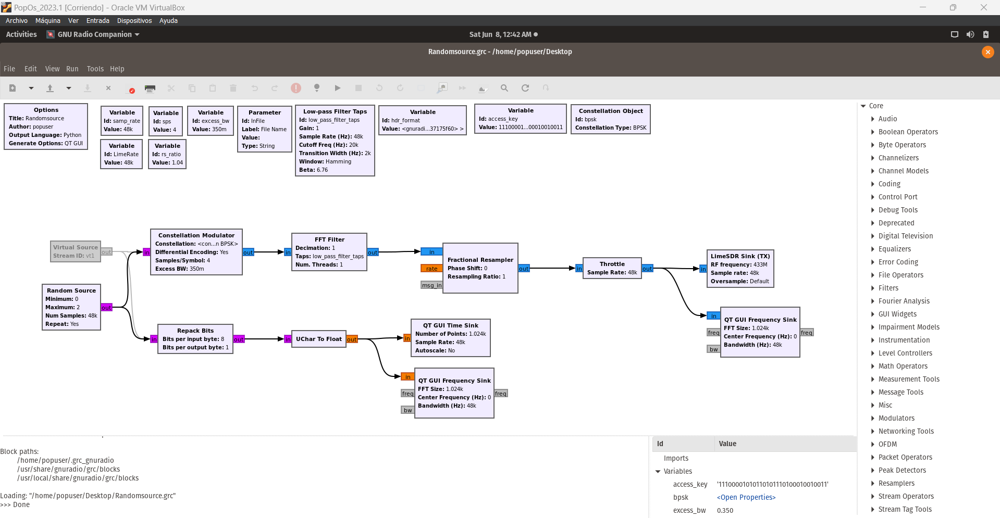
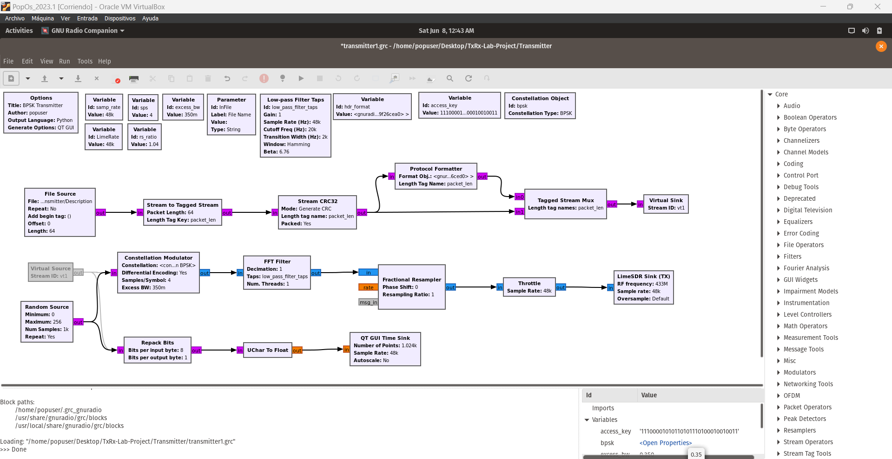

# TxRx BPSK Modulation
This project involves implementing a digital communication system for transmitting a text file using BPSK/QPSK modulation. Two LimeSDR boards will be used: one for transmission and the other one for reception.

# Content
1. Objectives
2. [Definitions](#definitions)
3. [Procedure](#procedure)
	- [Transmitter](#transmissor)
	- [Receptor](#receptor)
4. [Results](#results)
5. [Findings](#findings)
6. [Conclusions](#conclusions)
7. [References](#references)
8. [Credits](#credits)

# Objectives
1. Uploading of different types of files for subsequent processing.
2. Modulation of a text file using BPSK in block diagramming software (such as GNU Radio).
3. Integrate the hardware, being the LimeSDR device to develop a correct transmission and reception. Both with their respective modulation and demodulation.

# Definitions
- BPSK Modulation
  
BPSK stands for "Binary Phase Shift Keying". It is a type of modulation used in digital communication systems to transmit binary data over a communication channel.

In this type of modulation, the carrier signal is modulated by changing its phase by 180 degrees for each binary symbol. Specifically, a binary 0 is represented by a phase shift of 180 degrees, while a binary 1 is represented by no phase shift.

Having said the previous statement, a BPSK transmitter is implemented by coding the message bits using NRZ coding (1 represented by positive voltage and 0 represented by negative voltage) and multiplying the output by a reference oscillator running at carrier frequency f_c.

  

  *[BPSK transmitter](https://www.gaussianwaves.com/2010/04/bpsk-modulation-and-demodulation-2/)*

  

  *[BPSK Receiver](https://www.gaussianwaves.com/2010/04/bpsk-modulation-and-demodulation-2/)*

- GNU Radio
  

- LimeSDR
- Interpolation

Interpolation refers to the manipulation of the signal's sampling rate. The SDR receives a signal at a specific rate and it increases the sampling rate. It essentially creates new samples between the existing ones to achieve a smoother, higher-resolution signal. This is important for tasks like upconverting the signal to a higher frequency for transmission or accurately representing higher bandwidth signals. 

- Decimation

Decimation refers to a technique used to reduce the number of samples collected from the analog signal. It works by throwing away a certain number of samples according to a chosen decimation rate. For instance, a rate of 2 discards every other sample, while a rate of 8 keeps only 1 out of every 8. This lowers the data rate delivered to the software, which can be helpful for reducing processing load on a computer.  

However, decimation also reduces the effective bandwidth that the SDR can capture. This means there will be any missing signals outside the remaining bandwidth. Additionally, while it can improve the signal-to-noise ratio (SNR) by effectively lowering the noise floor, it's important to remember this is because it works at a smaller slice of the spectrum. There's no actual increase in the signal strength itself.  The way decimation and the chosen rate are used depend on the specific signal of interest and the capabilities of the SDR hardware/software that is going to be used.

# Procedure
Both transmitter and receiver were created with block designs on GNU Radio, based on the following links:
https://nuclearrambo.com/wordpress/transferring-a-text-file-over-the-air-with-limesdr-mini/
https://wiki.gnuradio.org/index.php?title=File_transfer_using_Packet_and_BPSK
https://www.youtube.com/watch?v=UpiaL1Hr6-s

Tx diagram
  
  

Rx diagram

# Results

# Findings
- It was incurred in a gain problem. The error statement referred to low gain usage, where "device_handler::set_gain()" was 6dB. However, the Tx needed 40 dB.

# Conclusions
1. 

# References
- NUCLEARRAMBO. (2019). *Transferring a text file over the air with LimeSDR mini*. https://nuclearrambo.com/wordpress/transferring-a-text-file-over-the-air-with-limesdr-mini/
- Duggan, B. (2023). *File transfer using Packet and BPSK*. https://wiki.gnuradio.org/index.php?title=File_transfer_using_Packet_and_BPSK

# Credits
Javier Castañeda, Hellnska Velásquez, Pablo Flores, Rafael Toj, Sandra López, Rafael Gómez, Juan Barillas, Rodrigo Méndez & Camila Puaque.